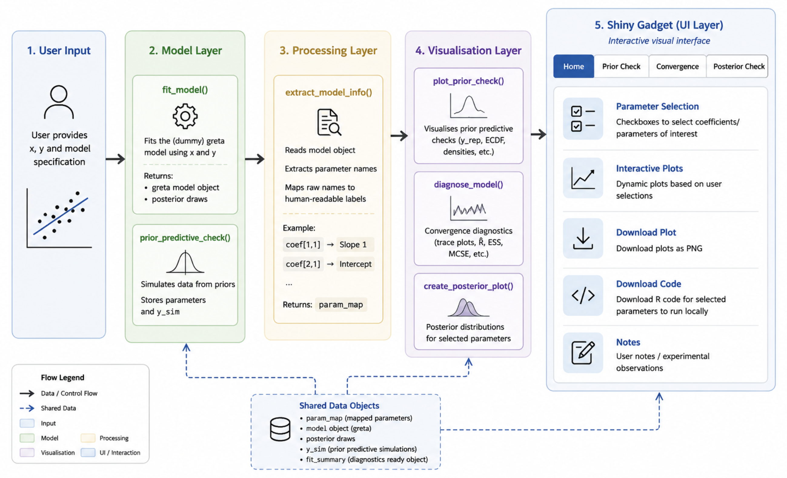

# Epiwave Visualisation Gadget

## Project Structure

project/
│
├── raw/
│   ├── data.csv
│   ├── homepage.txt
│   └── diagram.png
│
├── www/
│   ├── style.css
│   └── script.js
│
├── R/
│   ├── diagnose_model.R
│   ├── download_plot.R
│   ├── epiwaveVisualisationGadget.R
│   └── extract_model_info.R
│   └── fit_model.R
│   └── plot_convergence.R
│   └── plot_posterior_check.R
│   └── plot_prior_check.R
│   └── prior_check.R
│   └── summarise_greta.R
│   └── validate_model.R
│
└── Main.R

## Setup

Run everything in `Main.R`

1. Initial setup - download packages
2. Create a list of x observation 
3. Prior Predictive Checking 
- If the gadget is run at this stage, only the prior tab is going to be populated. It is normal for the other tabs to show none.
4. Fit the model - returns a list
5. Map the information into a data frame for consistency and integrity of the data
6. Run the gadget 

Objects in list format

## Flow Diagram

Contact via tkdel34@gmail.com for any questions